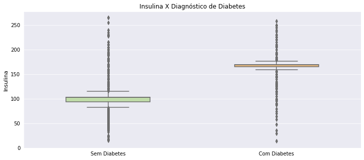
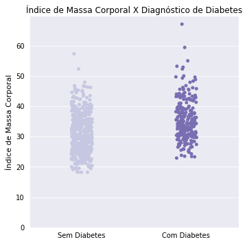
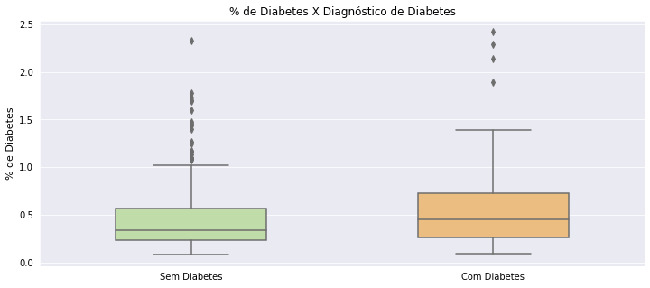
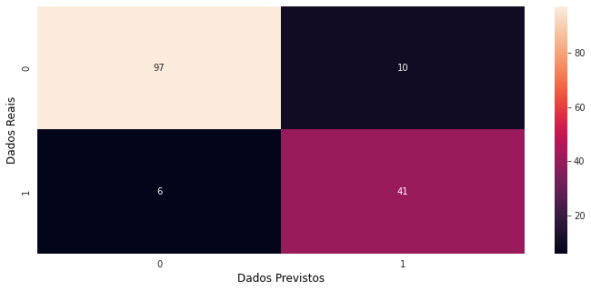

# Previsão de Diabetes (Projeto de Classificação)
## Projeto de Machine Learning

Neste projeto de dados, utilizei um conjunto de dados relativo ao diagnóstico de diabetes de várias pacientes consultadas, e com base em tal conjunto de dados, construi um modelo de classificação para prever e classificar se uma determinada paciente têm diabetes ou não.

Tal projeto é dividido entre às fases de **(1)** tratamento de dados, **(2)** análise exploratória de dados, **(3)** preparação e treino do modelo de machine learning e **(4)** ajuste de hiperparâmetros.

Utilizei Pandas e Numpy para manipulação de dados, Seaborn e Matplotlib para visualização de dados, e Sklearn para implementação, treinamento de modelos, avaliação de métricas e ajuste de hiperparâmetros.

Após a importação do dataset, verifiquei o formato de linhas e colunas do conjunto de dados:

* 768 linhas
* 9 colunas

Em seguida, visualizei às primeiras cinco linhas da tabela:

|   | Pregnancies | Glucose | BloodPressure | SkinThickness | Insulin | BMI  | DiabetesPedigreeFunction | Age | Outcome |
|---|-------------|---------|---------------|---------------|---------|------|--------------------------|-----|---------|
| 0 | 6           | 148     | 72            | 35            | 0       | 33.6 | 0.627                    | 50  | 1       |
| 1 | 1           | 85      | 66            | 29            | 0       | 26.6 | 0.351                    | 31  | 0       |
| 2 | 8           | 183     | 64            | 0             | 0       | 23.3 | 0.672                    | 32  | 1       |
| 3 | 1           | 89      | 66            | 23            | 94      | 28.1 | 0.167                    | 21  | 0       |
| 4 | 0           | 137     | 40            | 35            | 168     | 43.1 | 2.288                    | 33  | 1       |

Concluída a importação do dataset, comecei a limpar e tratar o conjunto de dados, como uma fase inicial para às próximas etapas do projeto:

## Tratamento de dados:

Na fase de tratamento de dados, realizei:

* **Reformatação textual do nome das colunas:**

Construi um list-compreehension para converter todos os nomes das colunas do dataset para minúsculo, desse modo quando fosse me referir ao nome das colunas, não teria que escrever com letra maiúscula a primeira letra de cada coluna:

```
# Formatação textual do nome das colunas, para que todas colunas estejam em minúsculo:

df.columns = [x.lower() for x in df.columns]
```
Saída com o nome das colunas transformado:

```
['pregnancies', 'glucose', 'bloodpressure', 'skinthickness', 'insulin',
       'bmi', 'diabetespedigreefunction', 'age', 'outcome'] 
 ```
* **Tratamento de dados nulos:**

Usei o método .isna().sum() para verificar a quantidade de dados nulos em cada coluna no conjunto de dados e obtive:

```
pregnancies                 0
glucose                     0
bloodpressure               0
skinthickness               0
insulin                     0
bmi                         0
diabetespedigreefunction    0
age                         0
outcome                     0
dtype: int64
```

Ou seja, não havia nenhum dado ausente registrado no conjunto de dados.

Após concluir os principais passos da limpeza de dados, decidi começar o processo de análise exploratória dos dados, para extrair informações e insights importantes sobre o conjunto de dados em questão:

## Análise Exploratória De Dados (EDA):

Antes de inicializar a etapa de análise exploratória, é imprescindível ter um dicionário de dados que explique rapidamente o quê cada coluna informa no conjunto de dados que será analisado:

#### Dicionário de Dados

* **pregnancies** - Número de gravidezes
* **glucose** - Nível de glicose no sangue
* **bloodpressure** - Medição da pressão sanguínea
* **skinthickness** - Espessura da pele
* **insulin** - Nível de insulina no sangue
* **bmi** - Indicador de massa corporal
* **diabetespedigreefunction** - Porcentagem de diabetes no sangue
* **age** - Idade
* **outcome** - Resultado de diabetes (1 - Sim; 0 = Não)

Tendo um dicionário de dados disponível, inicializei tal exploração analítica com uma pergunta básica:

#### (1) Qual foi a quantidade de pacientes diagnosticados com diabetes ou não?

Basicamente, após manipular os dados, obtive como resposta que 65 % (500 pacientes) das pacientes não foram diagnosticadas com diabetes, enquanto às demais 34 % (268) das pacientes receberam diagnóstico confirmativo de diabetes.

Plotei um gráfico de colunas para expor visualmente a quantidade de pacientes não diagnosticadas com diabetes em comparação com às pacientes diagnosticadas:


Com tal informação inicial, comecei a analisar cada variável separadamente do dataset, para analisar como cada variável impacta, influencia ou é estatisticamente correlacionada com à variável target, isto é, com a variável que informa se a paciente têm diabetes ou não.

#### (2) A quantidade de gravidezes de uma paciente é correlacionada com o fato da paciente ter diabetes ou não?

Com o método .unique() é verificável que há pacientes sem nenhuma gravidez até pacientes com 17 gravidezes registradas, porém majoritariamente há mais pacientes que tiveram somente uma gravidez até então.

Ou com dados mais detalhados, 55 % das pacientes consultadas têm de nenhuma até 3 gravidezes registradas (0-3), enquanto às de mais 45 % das pacientes têm mais de 4 gravidezes.

Com esses dados, decidi ter em tabelas separadas, a quantidade de pacientes com ou sem diabetes agrupada pela quantidade de gravidezes tidas:

| outcome     | 0   |
|-------------|-----|
| pregnancies |     |
| 1           | 106 |
| 2           | 84  |
| 0           | 73  |
| 3           | 48  |
| 4           | 45  |
| 5           | 36  |
| 6           | 34  |
| 7           | 20  |
| 8           | 16  |
| 10          | 14  |
| 9           | 10  |
| 12          | 5   |
| 13          | 5   |
| 11          | 4   |
| 14          | 0   |
| 15          | 0   |
| 17          | 0   |

É vísivel que em suma maioria, às pacientes sem nenhuma gravidez e às que tiveram ao menos duas gravidezes são às pacientes que receberam menos diagnósticos confirmativos de diabetes.

| outcome     | 1  |
|-------------|----|
| pregnancies |    |
| 0           | 38 |
| 1           | 29 |
| 3           | 27 |
| 7           | 25 |
| 4           | 23 |
| 8           | 22 |
| 5           | 21 |
| 2           | 19 |
| 9           | 18 |
| 6           | 16 |
| 10          | 10 |
| 11          | 7  |
| 13          | 5  |
| 12          | 4  |
| 14          | 2  |
| 15          | 1  |
| 17          | 1  |

Interessantemente, às pacientes que mais receberam diagnósticos de diabetes foram às pacientes que não tiveram nenhuma gravidez até então.

E como é sabido que mulheres com diabetes tendem à ter mais dificuldade para engravidar, então é esperado ou suposto parcialmente que haja mais incidência de diabetes em mulheres sem nenhuma gravidez (constando que essas apresentam mais dificuldade para engravidarem).

Não há uma correlação tão significativa entre gravidez e diabetes, porém há uma influência entre diabetes e dificuldade para engravidar, o que poderia justificar hipoteticamente o porquê mulheres sem filhos são às com mais casos de diabetes registrado.

#### (3) Qual é a relação do nível de glicose no sangue com a diabetes?

Glicose ou glicemia é a taxa de açúcar contida no sangue humano, e é sabido que há uma relação estreita entre o nível de glicose e diabetes, isto é, índividuos com altos níveis de diabetes, tendem à ser portadores de diabetes.

No conjunto de dados, há pacientes com um nível de glicose de 44 mg/dl até pacientes com uma glicose de 199 mg/dl.

Aproximadamente, em média as pacientes consultadas contêm 121 mg/dl de glicose no sangue, e isto é justificadamente esperado, até porque se a maioria das pacientes não têm diabetes, e como índividuos sem diabetes tendem à ter uma glicose abaixo de 125 mg/dl, então é esperado que as pacientes desse conjunto de dados tenham um nível de glicose abaixo de 125.

Às informações colhidas sobre o nível de glicose entre às pacientes sem diabetes são:

* Em média, às pacientes sem diabetes têm uma glicose em torno de 110 mg/dl 
* 50 % das pacientes sem diabetes têm uma glicose abaixo de 107 mg/dl, enquanto às outras 50 % têm uma glicose acima de 107
* 75 % das pacientes sem diabetes têm uma glicose abaixo de 125 mg/dl 

Já sobre às pacientes com diabetes:

* Em média, às pacientes com diabetes têm uma glicose em torno de 142 mg/dl
* 50 % das pacientes com diabetes têm uma glicose abaixo de 140 mg/dl, enquanto às outras 50 % têm uma glicose acima de 140
* A assimetria da glicose de pacientes com diabetes é 0.10, ou seja, é assimetricamente positiva, o que significa que a maioria das pacientes apresenta um nível de glicose acima da média de glicose, que é 142 mg/dl.

Somente essas informações estatísticas demonstram rapidamente que há uma correlação entre glicose e diabetes, isto é, pacientes com diabetes tendem à ter mais nível de glicose no sangue em comparação à pacientes sem diabetes diagnosticada.

Por fim, plotei um gráfico de histograma para ter uma interpretação visual sobre a distribuição de frequência do nível de glicose das paciente sem diabetes em comparação às pacientes com diabetes:


Tal gráfico expõe visualmente que pacientes com diabetes têm uma concentração de glicose acima de 125 mg/dl, enquanto pacientes sem diabetes têm uma concentração de glicose em torno de 100 mg/dl.

Confirmativamente, é vísivel que o nível de glicose é uma variável que influencia ou é correlacionada com o fato de uma paciente ter diabetes ou não.

#### (4) Qual é a média e a mediana de pressão sanguínea das pacientes com diabetes em comparação às pacientes sem diabetes?

Criei uma tabela para trazer tais informações estatísticas concernentes à pressão sanguínea das pacientes:

|               |mean   |        |median|      |std    |       |
|---------------|-------|--------|------|------|-------|-------|
| outcome       | 0     | 1      | 0    | 1    | 0     | 1     |
| bloodpressure | 70.92 | 75.12  | 72.0 | 74.0 | 11.93 | 11.95 |

Aproximadamente, em média a pressão sanguínea de pacientes sem diabetes é 70 mmHg, enquanto a pressão sanguínea de pacientes com diabetes é em torno de 75 mmHg.

Já em relação à mediana, 50 % das pacientes sem diabetes têm uma pressão sanguínea abaixo de 72 mmHg, enquanto à outra metade têm uma pressão sanguínea acima de 72.

Sobre às pacientes com diabetes, 50 % das pacientes têm uma pressão sanguínea abaixo de 74 mmHg, enquanto à outra metade têm uma pressão sanguínea acima de 74.

Mas já em relação ao desvio-padrão, tanto às pacientes sem quanto às pacientes com diabetes, apresentam uma mesma variação de pressão sanguínea de 11 mmHg em relação à média.

Com base em tais informações, é vísivel que não há uma diferença tão notável na pressão sanguínea das pacientes sem diabetes em comparação com às pacientes com diabetes.

No entanto, um gráfico de dispersão seria útil para vermos a distribuição de frequência da pressão sanguínea de cada tipo de paciente (sem diabetes x com diabetes):


O gráfico confirma visualmente o que foi suposto teoricamente, de que não há uma correlação estrita entre pressão sanguínea e diabetes.

#### (5) Há alguma diferença estatisticamente notável na espessura de pele de pacientes com diabetes em relação aos sem diabetes?

Para responder tal pergunta, criei novamente uma tabela com informações estatísticas relativa à espessura da pele dos dois grupos de pacientes (sem diabetes x com diabetes):

|               |   mean|        |median|      |std   |      |
|---------------|-------|--------|------|------|------|------|
| outcome       | 0     | 1      | 0    | 1    | 0    | 1    |
| skinthickness | 27.73 | 31.69  | 29.0 | 29.0 | 8.55 | 8.66 |

Visivelmente, não há um contraste tão significativo entre a espessura da pele de pacientes sem diabetes em comparação às pacientes sem diabetes.

Basicamente, em média tanto pacientes sem diabetes enquanto pacientes com diabetes apresentam aproximadamente à mesma espessura de pele **(2,7 mm (sem diabetes), 3,1 mm (com diabetes))**, já em relação à mediana e ao desvio-padrão, a espessura da pele de pacientes sem ou com diabetes não apresentam nenhuma diferença significativamente destacável.

Um gráfico de dispersão demonstrará que não há nenhuma diferença estatisticamente significante na espessura da pele de pacientes sem diabetes em comparação à pacientes com diabetes:


Como é confirmado no gráfico, não há nenhuma correlação perceptiva entre espessura da pele e o diagnóstico de diabetes.

#### (6) Qual é a relação estatística entre o nível de insulina no sangue e o diagnóstico de diabetes?

Como é sabido, há uma correlação entre nível de insulina no sangue e diabetes, isto é, indíviduos com diabetes tendem à ter altos níveis de insulina, mesmo que alto nível de insulina não seja necessariamente uma sinalização de diabetes.

O nível de insulina no sangue das pacientes sem diabetes apresentam determinadas características:

* Em média, pacientes sem diabetes têm um nível de insulina em torno de 117 mg/dl
* 50 % das pacientes sem diabetes têm uma insulina abaixo de 102 mg/dl, enquanto à outra metade têm uma insulina acima de 102
* 75 % das pacientes sem diabetes têm uma insulina abaixo de 175 mg/dl

Majoritariamente, pacientes sem diabetes apresentam um nível de insulina saudável abaixo de 140 mg/dl (que é o nível de insulina consideravelmente saudável).

Já em relação à pacientes com diabetes:

* Em média, pacientes com diabetes têm um nível de insulina em torno de 187 mg/dl
* 50 % das pacientes sem diabetes têm uma insulina abaixo de 169 mg/dl, enquanto à outra metade têm uma insulina acima de 169
* 75 % das pacientes sem diabetes têm uma insulina abaixo de 169 mg/dl

Majoritariamente, pacientes com diabetes têm um nível de insulina acima de 140 mg/dl, ou seja, pacientes com diabetes têm um nível de insulina não-saudável e acima do normal em comparação à pacientes sem diabetes.

Plotei um gráfico de boxplot (caixa) para ver a distribuição de insulina de pacientes sem diabetes e pacientes com diabetes:



Graficamente é observável que a maioria dos pacientes sem diabetes apresentam um nível de diabetes em torno de 100 mg/dl, enquanto pacientes com diabetes apresentam um nível de insulina altíssimo acima de 150 mg/dl.

É vísivel que há uma relação estatística entre nível de insulina sanguíneo e diagnóstico de diabetes, logo é conclusivo que tal variável de insulina será útil como variável preditora para a construção posterior do modelo de machine learning.

### (7) O índice de massa corporal das pacientes apresenta alguma relação com o fato destas pacientes terem sido diagnosticadas com diabetes ou não?

Criei uma tabela que expõe às principais informações estatísticas de índice de massa corporal em relação aos pacientes sem diabetes ou com diabetes registrada:

|         | mean  |        |median|      |std  |      |
|---------|-------|--------|------|------|-----|------|
| outcome | 0     | 1      | 0    | 1    | 0   | 1    |
| bmi     | 30.85 | 35.4   | 30.1 | 34.3 | 6.5 | 6.59 |

Estatisticamente, há uma diferença mínima de índice de massa corporal entre pacientes sem diabetes e pacientes com diabetes, em média pacientes sem diabetes têm um IMC (índice de massa corporal) que é classificado como sobrepeso (e é próximo da obesidade), enquanto pacientes com diabetes têm um IMC em torno de 35, que já é classificado como obesidade.

Porém, não há uma diferença tão significativamente notável no IMC de pacientes sem diabetes em comparação às pacientes com diabetes:



O gráfico de dispersão acima reafirma o que já foi confirmado anteriormente, através das informações estatísticas analisadas.

### (8) A porcentagem de diabetes é drasticamente maior nas pacientes com diabetes em comparação às pacientes sem diabetes?

Como é suposto, é expectante que pacientes com diabetes tenham uma porcentagem de diabetes maior em comparação à pacientes sem diabetes.

A tabela abaixo traz alguns dados estatísticos sobre a porcentagem de diabetes para os dois grupos distintos de pacientes:

|                          |mean  |        |median|      |std  |      |
|--------------------------|------|--------|------|------|-----|------|
| outcome                  | 0    | 1      | 0    | 1    | 0   | 1    |
| diabetespedigreefunction | 0.43 | 0.55   | 0.34 | 0.45 | 0.3 | 0.37 |

Pacientes com diabetes tendem à ter aproximadamente uma taxa adicional de 10 % de diabetes em comparação à pacientes sem diabetes, ou seja, tal dado expõe o que era esperado de que pacientes com diabetes tenham uma porcentagem mais significativa de diabetes no sangue.

Plotei um gráfico de boxplot (caixa) para expor tal informação visualmente:



Tal gráfico expõe e confirma a diferença de porcentagem de diabetes em pacientes sem diabetes em comparação à pacientes com diabetes.

### (9) Há alguma correlação vísivel entre a idade da paciente e o fato da paciente ter diabetes ou não?

Exporei uma tabela com tais informações estatísticas relativa à esses dois grupos distintos de pacientes:

|         |mean   |        |median|     |std    |       |
|---------|-------|--------|------|-----|-------|-------|
| outcome | 0     | 1      | 0  | 1   | 0     | 1     |
| age     | 31.19 | 37.07  | 27 | 36  | 11.67 | 10.97 |

Em média, às pacientes avaliadas têm uma idade em torno de 33 anos.

50 % das pacientes avaliadas têm uma idade abaixo de 30 anos, enquanto à outra metade têm uma idade acima de 30 anos.

Em relação às pacientes sem diabetes, é constatável estatisticamente que:

* Em média, as pacientes sem diabetes têm uma idade em torno de 31 anos
* 75 % das pacientes sem diabetes têm uma idade inferior à 37 anos

Já em relação às pacientes com diabetes, é constatado que:

* Pacientes com diabetes em média têm idade em torno de 37 anos
* 50 % das pacientes com diabetes têm uma idade superior à 36 anos
* 75 % das pacientes com diabetes têm uma idade abaixo de 44 anos

Graficamente, tais informações são expostas em um histograma:


É vísivel que às pacientes sem diabetes têm um intervalo de idade concentrado entre 20 e 30 anos, enquanto pacientes com diabetes frequentemente apresentam uma idade próxima aos 40 anos, e apresentam um intervalo de idade mais concentrado dos 20 até os 40 anos.

Após realizar várias análises e extrair alguns insights e informações valiosas sobre tal conjunto de dados, é imprescindível começar os próximos passos de aplicação do modelo de machine learning.

## Separação - Dados de Treino X Dados de Teste

Com o método train_test_split, separei o conjunto de dados em dados de treino e dados de teste, os dados de treino serão aplicáveis para treinar o modelo, enquanto os dados de teste serão aplicados para testar e validar a precisão preditiva do modelo.

Primeiramente, separei o conjunto de dados entre às variáveis preditoras e a variável target, às variáveis preditoras que irão ser utilizadas para prever se uma paciente têm diabetes ou não, são:

* pregnancies
* glucose
* insulin
* bmi
* diabetespedigreefunction
* age

Já a variável target que será utilizada é a variável:

* outcome

Após isto, separei o conjunto de dados em 80 % de dados para treino e 20 % para teste do modelo de machine learning:

```
# Separação entre dados de treino e dados de teste:
# 20 % para teste e 80 % de dados para treino:

X_train, X_test, y_train, y_test = train_test_split(X, y, test_size = 0.2, random_state = 0)
```
Concluída a separação entre dados de treino e dados de teste, apliquei o Feature Scaling para colocar todas às variáveis na mesma escala de intervalo numérica.

## Feature Scaling

Importei o método StandardScaler() para colocar todas às variáveis na mesma escala intervalar de -3 e +3:

```
# Atribuição de tal método de padronização de escala à uma variável:

sc = StandardScaler()
```

Padronização aplicada aos dados de treino:
```
X_train_2 = sc.fit_transform(X_train)
```
Padronização aplicada ao dados de teste:
```
X_test_2 = sc.transform(X_test)
```
Tal padronização não foi aplicada sob a variável target, porque tal variável já estava no intervalo entre -3 e +3, simplesmente por ser uma variável categórica de 0's (sem diabetes) e 1's (com diabetes)

## Treino do modelo de floresta aleatória (Random Forest):

Após treinar vários modelos de classificação, o melhor modelo treinado foi o modelo de floresta aleatória que obteve uma acurácia preditiva de aproximadamente 90 %.

Primeiramente, importe o modelo RandomForest() da biblioteca sklearn:

```
from sklearn.ensemble import RandomForestClassifier
```

Atribui o modelo importado à uma variável:

```

random_forest_classifier = RandomForestClassifier(random_state = 0,
                                                  n_estimators = 10)
```
Por fim, treinei o modelo sobre os dados de treino:
```
random_forest_classifier.fit(X_train_2, y_train)
```
Concluída a fase de treino do modelo, fui diretamente avaliar e validar a precisão preditiva do modelo construído:

## Teste de acurácia do modelo de floresta aleatória

Primeiramente, importei os métodos accuracy_score() e confusion_matrix() para avaliar o quão bom o modelo é para realizar previsões relativo ao diagnóstico de diabetes das pacientes consultadas:

```
from sklearn.metrics import confusion_matrix, accuracy_score
```
Depois, atribui à uma variável, às previsões realizadas pelo modelo sob o conjunto de dados de teste:

```
y_pred_3 = random_forest_classifier.predict(X_test_2)
```
Com tais dados previstos pelo modelo, comparei os dados previstos pelo modelo em relação aos dados reais de teste (relativo ao diagnóstico de diabetes das pacientes):

```
accuracy_score(y_test, y_pred_3).round(2)
```
Como saída obtive:
```
0.9
```
Ou seja, tal modelo obteve estimadamente uma precisão preditiva de 90 %.

Isso significa, que de todas às previsões feitas pelo modelo, o modelo acertou quase 90 % de todas às previsões realizadas.

Para avaliar em mais detalhes a acurácia do modelo, decidi construir uma confusão de matriz para ter a informação sobre a quantidade de previsões corretas e incorretas feitas pelo modelo:



Interpretativamente, o modelo de floresta aleatória acertou 97 previsões relativas às pacientes sem diabetes e errou 10 previsões de pacientes que não tinham diabetes e foram classificadas como se tivessem diabetes, já em contrapartida o modelo acertou 41 previsões de pacientes com diabetes e errou 6 previsões pacientes que tinham diabetes e foram classificadas como se não tivessem diabetes.

Depois deste passo de avaliação do modelo, fui diretamente para a fase de ajuste dos hiperparâmetros, para definir os melhores parâmetros do modelo, para que o modelo atinja o nível máximo de qualidade em suas previsões:

## Ajuste de Hiperparâmetros (Hyperparameter Tuning):

Nesta fase final, decidi ajustar os hiperparâmetros do modelo de floresta aleatória e do modelo de árvore de decisão, que foram os melhores modelos treinados para prever se às pacientes tinham diabetes ou não.

Importei o método GridSearchCV da biblioteca sklearn:

```
from sklearn.model_selection import GridSearchCV
```
Depois da importação do método, defini os hiperparâmetros que seriam testados no modelo, para vermos se tais modelos iriam melhorar suas perfomances preditivas:

```
model_params = {
    'random_forest': {
        'model': RandomForestClassifier(),
        'params': {
            'n_estimators': [10, 50, 100, 150, 200]
        }
    },
    'decision_tree_classifier': {
        'model': DecisionTreeClassifier(),
        'params': {'criterion': ['gini', 'entropy']
            
        }
    }
}
```
Defini que o modelo de floresta aleatória testará modelos de 10 árvores até 200 árvores em conjunto, para vermos se o aumento na quantidade de árvores irá melhorar às previsões do modelo.

Já para o modelo de árvore de decisão, defini que tal modelo testará somente dois critérios, o critério 'gini' e o critério 'entropy', para vermos qual dos dois critérios melhorará a perfomance do modelo.

Por fim, obtive uma tabela com os melhores hiperparâmetros definidos para cada modelo, com suas respectivas pontuações de acurácia preditiva obtida após o teste dos modelos treinados:

|       |          model           | best_score  |       best_params        |
|-------|--------------------------|-------------|--------------------------|
| 0     | random_forest            | 0.89        | {'n_estimators': 100}    |
| 1     | decision_tree_classifier | 0.87        | {'criterion': 'entropy'} |

Visivelmente, o modelo de floresta aleatória apresenta uma melhor perfomance de previsões ao usar 100 árvores em conjunto para treinar o modelo, com uma acurácia preditiva de 89 % em média.

Já o modelo de árvore de decisão têm uma melhor perfomance com o critério 'entropy' do que com o critério 'gini', isto é, tal modelo de árvore de decisão obtém em média uma acurácia preditiva de 87 %.

Concluída essa fase, é considerável que tal projeto está terminado, consegui construir um modelo de classificação com uma precisão de quase 90 % para prever e classificar se uma paciente têm diabetes ou não, com base em determinadas informações médicas e físicas sobre a paciente.

Espero que tenha gostado de tal projeto, e é isso, até mais!
